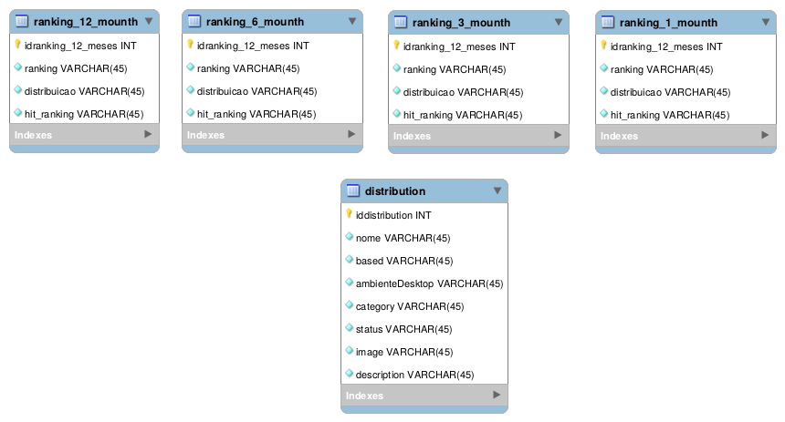

# API DistroWatch

This folder contains the codes related to site data collection (Code crawler_db.py), the data used for data analysis (data_csv folder) and the code responsible for popularizing the database for future use by the API.

# Database

The figure below shows the tables that will be used in the future for the API

